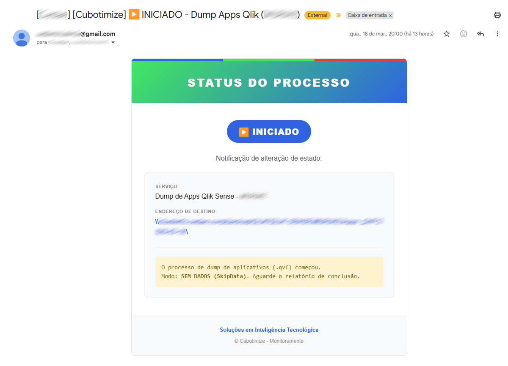
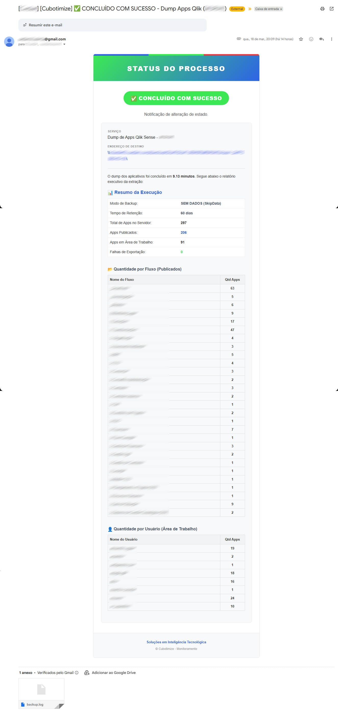
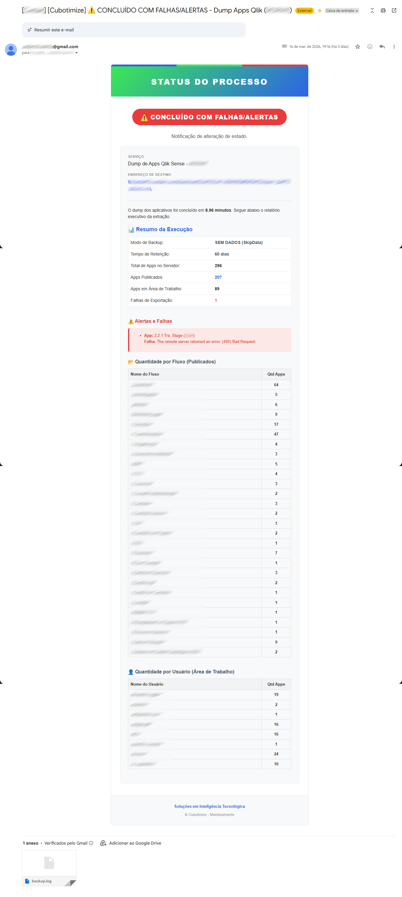

# 📦 Backups de Aplicações Qlik Sense Client-Managed (QVF)
[](https://github.com/mariosergioti/QlikSense_SCRIPT_Dumps_QVFs_QlikSenseClientManaged/archive/refs/tags/v2.4.1.zip)

Script em PowerShell para automação de dumps/backups de aplicativos (.qvf) do **Qlik Sense Client-Managed**.

Esta solução realiza a extração de todos os aplicativos do ambiente (tanto os Publicados em Fluxos quanto os Não Publicados nas Áreas de Trabalho dos usuários), organiza em pastas, gerencia a retenção de dados antigos e envia um relatório executivo em HTML via e-mail.

## ✨ Principais Funcionalidades

  * **Exportação Total:** Faz o dump de apps publicados e de áreas de trabalho (separando por dono/fluxo).
  * **Modo Flexível:** Escolha entre exportar COM dados ou SEM dados (`SkipData`).
  * **Gestão de Retenção:** Exclui automaticamente backups mais antigos que o limite configurado (ex: D-60).
  * **Auto-Hostname:** Identifica automaticamente o nome do servidor, ideal para ambientes em Cluster.
  * **Relatório Executivo HTML:** Envio de e-mails com design responsivo, ícones de alto contraste e resumo agregado de falhas e sucessos.

---

## 📋 Requisitos e Preparação

Para que o script consiga se comunicar com a API do Qlik Sense, é necessário ter o módulo PowerShell **Qlik-Cli-Windows** instalado no servidor onde a automação vai rodar.

### Como instalar e preparar o Qlik-Cli:

1.  Abra o **PowerShell como Administrador** no servidor do Qlik Sense.
2.  Execute o comando abaixo para instalar o módulo a partir da galeria oficial:
    ```powershell
    Install-Module -Name Qlik-Cli-Windows -Force
    ```
    *(Nota: Se o Windows perguntar sobre repositórios não confiáveis "PSGallery", digite `Y` ou `A` para aceitar).*
3.  **Pronto!** O script já está programado para buscar automaticamente os certificados internos do Qlik Sense (na raiz `Cert:\LocalMachine\My` ou `Cert:\CurrentUser\My`) e autenticar a conexão de forma silenciosa e segura.

---

## ⚙️ Configuração do Script

Antes de executar, você precisa ajustar algumas variáveis no arquivo `.ps1`:

### 1. Diretório de Backup (`$vPastaBackup`)

Defina onde os arquivos `.qvf` serão salvos. Pode ser um diretório local ou um caminho de rede (Storage/ClusterFS).

  * **Atenção aos Caminhos de Rede:** Se for utilizar um mapeamento de rede (ex: `\\SERVIDOR\BACKUP\QLIK\`), certifique-se de que o usuário que vai executar o script tem permissão de **Leitura e Escrita** nessa pasta.
  * *Dica:* Antes de rodar o script, copie o caminho configurado, abra o **Windows Explorer** no servidor do Qlik Sense com o usuário de serviço e tente colar o caminho lá. Se você conseguir criar um arquivo `.txt` manualmente nessa pasta, o script também conseguirá.

### 2. Configurações de E-mail (Google/Gmail)

O script está pré-configurado para usar o SMTP do Gmail. Você precisará ajustar as variáveis `$vEmailRemetente`, `$vEmailDestino` e `$vSenhaAppGmail`.

**⚠️ Importante: Como criar a Senha de Aplicativo no Google**
O Google não permite mais usar a sua senha normal para scripts. Você precisa gerar uma "Senha de App":

1.  Acesse a sua [Conta do Google](https://myaccount.google.com/).
2.  No painel de navegação à esquerda, clique em **Segurança**.
3.  Certifique-se de que a **Verificação em duas etapas** (2FA) esteja ativada.
4.  Na barra de pesquisa no topo, digite **"Senhas de app"** e clique na opção que aparecer.
5.  Crie um nome para o app (ex: "Script Qlik Backup") e clique em **Gerar**.
6.  Copie a senha de 16 letras (sem espaços) e cole na variável `$vSenhaAppGmail` do script.

---

## 🚀 Como Agendar no Windows (Task Scheduler)

Para que o backup rode de forma 100% autônoma e com as permissões corretas para acessar a API do Qlik Sense, **é obrigatório que o script seja executado pelo mesmo usuário que roda os serviços do Qlik Sense**.

### Passo 1: Descobrir o usuário de serviço do Qlik Sense

1.  No servidor do Qlik Sense, aperte `Win + R`, digite **`services.msc`** e dê Enter.
2.  Na lista de serviços, procure por serviços que começam com **"Qlik Sense"** (ex: *Qlik Sense Engine Service*, *Qlik Sense Repository Service*).
3.  Olhe para a coluna **"Fazer Logon Como"** (Log On As).
4.  Anote esse nome de usuário (ex: `DOMINIO\qlik_service`). Este é o usuário que deve executar a tarefa agendada!

### Passo 2: Criar a Tarefa Agendada

1.  Abra o **Agendador de Tarefas** (Task Scheduler) do Windows.
2.  Clique em **Criar Tarefa...** (Create Task...).
3.  Na aba **Geral**:
      * Dê um nome (ex: `Backup Qlik Sense QVFs`).
      * Em *Opções de Segurança*, clique em **Alterar Usuário ou Grupo** e insira o usuário de serviço descoberto no Passo 1.
      * Marque a opção **"Executar estando o usuário logado ou não"**.
      * Marque **"Executar com privilégios mais altos"**.
4.  Na aba **Gatilhos** (Triggers), defina a recorrência (ex: Diariamente às 23:00).
5.  Na aba **Ações** (Actions):
      * Ação: Iniciar um programa.
      * Programa/Script: `powershell.exe`
      * Adicione os argumentos (ajuste o caminho): `-ExecutionPolicy Bypass -File "C:\Caminho\Para\O\Script\QlikSense_SCRIPT_Dumps.ps1"`
6.  Salve a tarefa (o Windows pedirá a senha do usuário de serviço).

---

## 📧 Exemplos de Notificações

### ▶️ E-mail de Início


### ✅ E-mail de Sucesso


### ⚠️ E-mail com Alertas/Falhas


---

### 👨‍💻 Autor e Contatos

**Mario Sergio Soares**

  * 🌐 **Bio Page & Projetos:** [cubo.plus/mariosergioti](https://cubo.plus/mariosergioti)
  * 💼 **LinkedIn:** [linkedin.com/in/mariosergioti](https://linkedin.com/in/mariosergioti)
  * 🏢 **Empresa:** [Cubotimize](https://cubotimize.com)
  * 📊 **Mais Materiais Qlik:** [Meus Documentos, Apps e Arquivos na Qlik Community](https://community.qlik.com/t5/Brasil/Publica%C3%A7%C3%B5es-de-MARIO-SOARES-Documentos-Aplicativos-e-Arquivos/td-p/1464214)
